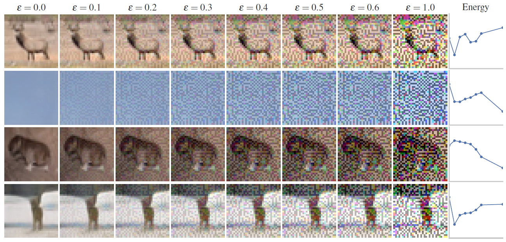

# Adversarial-Outlier-Exposure
This is the repository for the Workshop Paper: "Robust Out-of-Distribution Detection with Adversarial Outlier Exposure" by Konstantin Kirchheim and Thomas Botschen of OVGU Magdeburg.

Our work is based on the paper of https://arxiv.org/pdf/1812.04606.pdf and the github repository https://github.com/hendrycks/outlier-exposure.

Our new contribution is the integration of adversarial attacks on outliers during training.


# Repository Contents
In particular, this repository enables the user to do the following things:
- Finetune a pretrained WideResNet with (Adversarial) Outlier Exposure
- The Finetuning can get assisted by Adversarial Attacks on the Inliers and Outliers
- As Inlier Sets we currently support: CIFAR10, CIFAR100
- As Outlier Sets we use GAN-generated Images, which need to be manually created (see above) and added to the data folder /datasets
- Supported Adversarial Attacks: FGSM, PGD, MI-FGSM, EBA, EPS_GAUSS, None

 # Folder structure:
- config: default experiment configuration (will be overwritten by hydra)
- logic: 
    - eval.py: evaluation logic
    - training.py: training logic
    - utils.py: utility functions
    - attacks.py: adversarial attack logic

# Installation
We recommend using anaconda for version management and python 3.8 for compatibility
> pip install -r requirements.txt

Moreover, it is mandatory to place the GAN generated OOD data from below in the folder ```datasets/```
# GAN Generated Outliers
Outliers in this work were generated in this work: https://openreview.net/forum?id=SU7OAfhc8OM

The GAN generated files can be found at the link below: replace x.y with e.g. 2.0 to download the dataset generated with a sigma of 2.0 
> https://files.kondas.de/goe-data/samples-x.y.npz

Afterwards, place them in the folder ```datasets/```

# Run the code
The training with default parameters can be run by:
>python3 run.py --config-name NAME_OF_CONFIG

e.g.
>python3 run.py --config-name cifar_adversarial_auroc.yaml

Results get saved in a .xlsx file called "results.xlsx".


Synthetic Outliers drawn from a BigGAN trained-on CIFAR-100 with increasingly strong adversarial perturbation targeting the classifier's energy function. Perturbed OOD images do not resemble ID data but tend to have low energy-based outlier scores